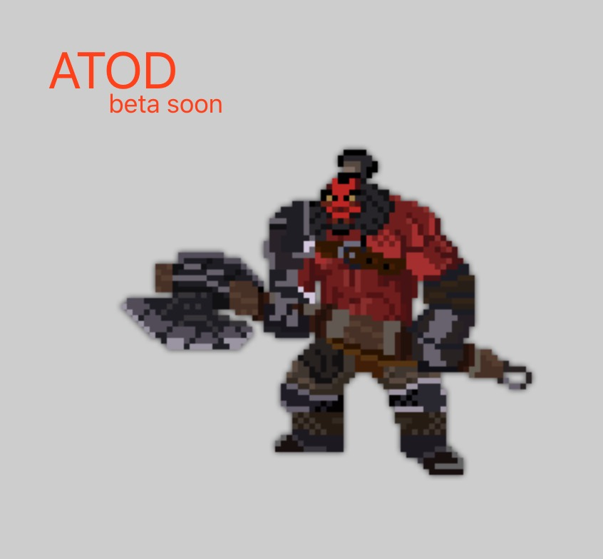

# ATOD（倒过来读就是DOTA)

## Base Tech
The HTML5 Creation Engine: Create beautiful digital content with the fastest, most flexible 2D WebGL renderer. 
https://github.com/pixijs/pixi.js

## development(temp)

> $ npm run lab 

open the browser，source code in `/examples/index.html`

## 关键词
2D、像素风、web版、“以撒的结合风格”，PVP，“DOTA英雄和技能”，“just for fun“。

## 功能描述
### 概述：
2D化DOTA英雄的技能，PVP进行对战，近百英雄随意挑。

### 模块（临时）：

* 网络模块：支持双向通信，能够保持低延迟。
* 选英雄模块：选择英雄。
* 地图生成模块：随机生成地图和地图类物品。
* 英雄模块：包含血量、属性、buff、debuff、技能。
* 游戏进程控制模块：控制游戏的整个流程，防止异常。